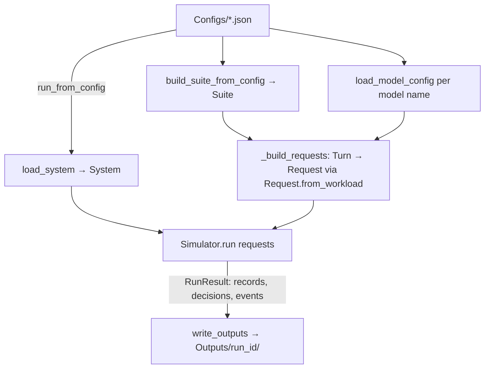

# serve_sim — Engineering & Maintenance Guide

> A map of the codebase for making changes confidently — even with no prior context.
> Pair this with [Project.md](Project.md) (the PRD / behavioural spec) and [Tests.md](Tests.md).
> When behaviour changes, update **all three**: the code, the PRD, and (if structure changes) this guide.

---

## 1. What serve_sim is

`serve_sim` is an event-driven **fluid co-simulation of large-scale LLM serving**. It takes a
declarative description of *what hardware exists*, *what models run on it*, and *what workload
arrives*, then simulates inference (prefill + decode, batching, parallelism, KV caching, weight
loading, data transfers) on a **roofline** model of compute and memory bandwidth, and writes a
detailed set of CSV/JSON reports.

Everything that drives a run is **data**: JSON files in the top-level data directories. The Python
package in [Src/serve_sim/](Src/serve_sim/) is the engine that interprets that data. Most "feature"
changes are either (a) adding/editing a JSON file, or (b) extending one engine module.

---

## 2. Run & test commands

```powershell
# Activate the venv (Windows PowerShell)
& c:\repos\serve_sim\.venv\Scripts\Activate.ps1

# Run a simulation from a config
python run_sim.py Configs/example.json
python -m serve_sim Configs/example.json --quiet      # equivalent module entry point

# Cache the source dataset locally (offline, reproducible runs)
python cache_dataset.py

# Full test suite (deselect the one live-network test that needs HuggingFace)
python -m pytest Tests/ -q --deselect Tests/test_integration.py::test_live_multi_turn_session_is_downloadable

# A single area
python -m pytest Tests/test_orchestrator.py -q
```

Outputs land in `Outputs/<run_id>/` (see §8).

---

## 3. Repository layout

### Data directories (edit JSON here — no code change needed)

| Directory | Holds | Referenced by | Schema in |
|---|---|---|---|
| [Models/](Models/) | One JSON per model architecture (layers, attention, FFN/MoE). | `suite.models`, resolved by file **stem**. | [model_config.py](Src/serve_sim/model_config.py) |
| [Compute_devices/](Compute_devices/) | One JSON per compute device (FLOPs, names its first-tier memory). | systems via `{"device": "<stem>"}`. | [device_config.py](Src/serve_sim/device_config.py) |
| [Memory_devices/](Memory_devices/) | One JSON per memory device (capacity, bandwidth). | compute devices (`first_tier_memory`), systems (`input_memory`, `node_memory`). | [device_config.py](Src/serve_sim/device_config.py) |
| [Systems/](Systems/) | One JSON per machine topology (network + nodes + devices). | `config.system`. | [system.py](Src/serve_sim/system.py) |
| [Suites/](Suites/) | Reusable workload-suite definitions. | `config.suite` (inline or path). | [suite.py](Src/serve_sim/suite.py) |
| [Configs/](Configs/) | Run configs — the single file you pass to the CLI. | the CLI. | [runner.py](Src/serve_sim/runner.py) (§7) |
| [Dataset/](Dataset/) | Local cache of the source agentic-traces dataset. | the workload loader. | [dataset.py](Src/serve_sim/dataset.py) |
| [Outputs/](Outputs/) | Per-run reports (git-ignored working output). | written by [report.py](Src/serve_sim/report.py). | §8 |

**Stem resolution:** files are referenced by filename without `.json`. `"nvidia-b200"` →
`Compute_devices/nvidia-b200.json`. A model named `"gemma-4-31b"` in a suite → `Models/gemma-4-31b.json`.

### Engine package — [Src/serve_sim/](Src/serve_sim/)

| Module | Responsibility | Key types / functions |
|---|---|---|
| [workload.py](Src/serve_sim/workload.py) | Conversation data model. | `Message`, `ToolCall`, `Turn`, `Workload`, `build_workload_from_rows` |
| [dataset.py](Src/serve_sim/dataset.py) | Fetch/cache source dataset rows → workloads. | `WorkloadLoader`, `HttpRowFetcher`, `LocalRowFetcher` |
| [suite.py](Src/serve_sim/suite.py) | Bind workloads to model names; build randomized suites. | `Suite`, `SuiteEntry`, `build_suite_from_config` |
| [tokenizer.py](Src/serve_sim/tokenizer.py) | Token counting. | `TiktokenTokenizer`, `WhitespaceTokenizer` |
| [blocks.py](Src/serve_sim/blocks.py) | Architecture primitives (cost/sizing math). | `Attention`, `DenseFFN`, `MoEFFN`, `MambaBlock`, `Layer`, `LayeredModel` |
| [model.py](Src/serve_sim/model.py) | Flat model + toy fixtures. | `Model`, `toy_model`, `toy_moe_model` |
| [model_config.py](Src/serve_sim/model_config.py) | Parse `Models/*.json` → `LayeredModel`. | `model_from_config`, `load_model_config` |
| [hardware.py](Src/serve_sim/hardware.py) | Compute/memory device primitives & roofline scaling. | `ComputeDevice`, `MemoryDevice`, `dtype_compute_scale` |
| [device_config.py](Src/serve_sim/device_config.py) | Parse device JSON → hardware objects. | `load_compute_device`, `load_memory_device` |
| [system.py](Src/serve_sim/system.py) | Parse a system JSON → live topology; classify links. | `System`, `Node`, `Network`, `load_system`, `link_between` |
| [transfer.py](Src/serve_sim/transfer.py) | Data-movement events + duration. | `TransferLink`, `make_transfer_event`, `transfer_duration`, `INTRA_PACKAGE` |
| [tracker.py](Src/serve_sim/tracker.py) | Per-sequence/batch token bookkeeping; prefix matching. | `SequenceTracker`, `BatchTracker`, `common_prefix_length` |
| [kv_cache.py](Src/serve_sim/kv_cache.py) | Per-sequence KV occupancy tracking. | `KVCacheTracker` |
| [kv_store.py](Src/serve_sim/kv_store.py) | **Global** system-wide persistent KV store (LRU, floating memories). | `KVCacheManager`, `KVEntry`, `Match`, `StoreResult` |
| [experts.py](Src/serve_sim/experts.py) | MoE expert-usage modelling. | `ExpertUsageModel` |
| [tiering.py](Src/serve_sim/tiering.py) | Expert residency / activation-trace caching. | `ExpertResidencyCache`, `build_activation_trace` |
| [shards.py](Src/serve_sim/shards.py) | Turn a batch into work shards. | `WorkShard`, `WorkShardGenerator` |
| [events.py](Src/serve_sim/events.py) | Generate compute events from shards. | `ComputeEvent`, `EventGenerator`, `EventSchedule` |
| [weights.py](Src/serve_sim/weights.py) | Model-weight load tracking. | `ModelWeightsTracker`, `WeightShard` |
| [parallelism.py](Src/serve_sim/parallelism.py) | Pipeline/expert/tensor parallelism planning. | `ParallelismChoice`, `ParallelismPlanner` |
| [placement.py](Src/serve_sim/placement.py) | Map work to engine slots/devices. | `EnginePool`, `EngineSlot`, `Placement` |
| [arbiter.py](Src/serve_sim/arbiter.py) | Resolve contention for compute & bandwidth over time. | `ResourceArbiter`, `IncrementalArbiter`, `ArbiterResult` |
| [pdd.py](Src/serve_sim/pdd.py) | Prefill/decode-disaggregation helpers; KV byte sizing. | `context_kv_bytes`, PDD pools |
| [orchestrator.py](Src/serve_sim/orchestrator.py) | **The simulator.** Batching, dispatch, decisions, retirement. | `Simulator`, `StrategyConfig`, `Request`, `RunResult`, `DecisionRecord` |
| [runner.py](Src/serve_sim/runner.py) | Glue: config → system/suite/models/requests → run → write. | `run_from_config`, `_strategy_from_config` |
| [cli.py](Src/serve_sim/cli.py) / [__main__.py](Src/serve_sim/__main__.py) | Command-line entry point. | `main` |
| [report.py](Src/serve_sim/report.py) | Aggregate metrics + write all output files. | `write_outputs`, `summarize` |

---

## 4. End-to-end pipeline



Inside `Simulator.run` each window of arrived requests is batched, then **dispatched** through:
parallelism planning → placement onto engine slots → shard generation → event generation →
**arbiter** (resolves compute/bandwidth contention over time) → retirement (records, KV offload).
Two scheduling paths exist: the **non-PDD** path (`run()`) and the **prefill/decode-disaggregated**
path (`_run_pdd()`), selected by `StrategyConfig.allow_pdd`. **Any orchestration change must usually
be made in *both* paths.**

Both paths finish in `_collect_outputs`, which calls `_check_memory_capacity`: the peak reserved
footprint (sum of concurrently-active jobs' `per_device_bytes`) on every compute device is compared
against its memory (first tier + any second tier). If a device is oversubscribed the run aborts with
`MemoryCapacityExceeded` rather than reporting an impossible occupancy. (A single batch that cannot
fit one device is rejected earlier, in `_parallelism_for`.)

---

## 5. "How do I change X" playbooks

### Add or modify a supported **model**
1. Add `Models/<name>.json`. Schema: a `global` block (`num_layers`, `hidden_size`, `vocab_size`,
   `param_dtype_bytes`, `kv_dtype_bytes`, `tie_word_embeddings`, `layer_pattern`), a `blocks` map,
   and the `layer_pattern` listing a block name per layer (length must equal `num_layers`).
2. Block kinds (see [model_config.py](Src/serve_sim/model_config.py) `_build_layer`):
   - `composite` — a mixer (`attention` or `mamba`) plus optional `ffn`.
   - `attention` — standalone attention layer.
   - `mamba` — standalone Mamba mixer.
   - `ffn` — standalone FFN (`ffn_type`: `dense` or `moe`).
   - MoE FFN needs `num_experts`, `num_experts_per_token`, `intermediate_size` (plus optional
     `num_shared_experts`, `moe_latent_size`, …).
3. Reference it: add the stem to a suite's `models` list (or `Suites/*.json`).
4. **New mechanism?** If the architecture needs a not-yet-implemented mixer (MLA/DSA/Mamba paths
   raise `NotImplementedError`), implement it in [blocks.py](Src/serve_sim/blocks.py) first, then
   wire the spec keys in [model_config.py](Src/serve_sim/model_config.py).
5. Tests: see [Tests/test_models.py](Tests/test_models.py), [Tests/test_model.py](Tests/test_model.py).

### Add or modify a **compute device**
1. Add `Compute_devices/<name>.json`: `name`, `peak_flops_fp16`, `first_tier_memory` (a memory
   **stem**), optional `kernel_launch_latency`. (Second-tier memory is a *system* choice, not set here.)
2. Ensure its `first_tier_memory` exists in `Memory_devices/`.
3. Reference it from a system node's `compute_devices`.
4. Tests: [Tests/test_devices.py](Tests/test_devices.py), [Tests/test_hardware.py](Tests/test_hardware.py).

### Add or modify a **memory device**
1. Add `Memory_devices/<name>.json`: `name`, `capacity_bytes`, `bandwidth_bytes_per_s`.
2. Use it as a device's `first_tier_memory`, a system's `input_memory`, or a node's `node_memory`.

### Add or modify a **system architecture**
1. Add `Systems/<name>.json`: `name`, `network` (scale-up + CXL bandwidth/latency), `input_memory`
   (the shared NVM stem holding all weights at init), and `nodes`.
2. Each node: `name`, optional `node_memory` (the "floating" CPU memory — see KV cache below), and
   `compute_devices` as `{"device": "<stem>", "count": N}`.
3. **Identity matters:** `count: 4` expands to four *distinct* device instances, each with its own
   first-tier memory and a node-qualified name (`"NVIDIA B200 [node-0 #2]"`). The arbiter and event
   generator contend on object identity, so never share one instance across logical devices.
4. Point a config's `system` at the new file.
5. Tests: [Tests/test_system.py](Tests/test_system.py), [Tests/test_placement.py](Tests/test_placement.py).

### Create or modify a **run config / suite**
- A config (§7) names a `system`, a `suite` (inline object or path string), `models_dir`, dataset,
  strategy knobs, and output options. Paths are resolved **relative to the config file**.
- A randomized suite draws `num_workloads` from the dataset and assigns each a random model from
  `models`. Determinism comes from `random_seed`.

### Change orchestration behaviour / add a `StrategyConfig` knob
1. Add the field (with default + docstring) to `StrategyConfig` in
   [orchestrator.py](Src/serve_sim/orchestrator.py).
2. Map it from config in `_strategy_from_config` in [runner.py](Src/serve_sim/runner.py)
   (`cfg.get("<key>", <default>)`).
3. Implement the behaviour — **in both `run()` and `_run_pdd()`** if it affects scheduling.
4. Document it in [Project.md](Project.md) (strategy knobs + parameter list).
5. Tests: [Tests/test_orchestrator.py](Tests/test_orchestrator.py),
   [Tests/test_runner.py](Tests/test_runner.py).

### Add a new **orchestration decision kind** or output column
1. Decisions are `DecisionRecord`s (frozen) appended to `result.decisions`. Fields include
   `time, kind, request_id, workload_id, turn_index, model, devices, batch_index, tokens` and the
   optional `source_*` fields for two-sequence acts (reuse/transfer).
2. Emit via the `_decision(...)` helper (or a dedicated builder, e.g. `_eviction_decision`).
3. Register the kind in `_DECISION_KINDS` in [report.py](Src/serve_sim/report.py) so it is counted
   and written to `orchestration_decisions.csv`; add fields to `_DECISION_FIELDS` if new columns.
4. Current kinds: `weight_load`, `weight_eviction`, `prefill`, `kv_reuse`, `kv_transfer`, `decode`, `kv_eviction`, `expert_load`, `expert_eviction`.

### Weight staging and MoE expert streaming — [orchestrator.py](Src/serve_sim/orchestrator.py)
- **What it does:** stages every model through host RAM before serving. A model's **home node** is
  the node whose `node_memory` can hold its *full* weights (`ParallelismPlanner.full_model_bytes`),
  preferring a node that already owns the serving slot's device. `_weight_load_events` then emits two
  `weight_transfer` stages — NVM → home RAM (once per model, tracked in `self._home_loaded`) and home
  RAM → device (the resident, **non-expert** footprint `streaming_footprint(pp, 0, 0, tp)`).
- **Expert streaming:** for MoE models the routed experts are **not** pinned; they stream on demand.
  `_dispatch` builds an activation trace (`build_activation_trace`), sizes an LRU residency cache to
  the batch's peak working set per EP rank (`peak_active_per_rank`), and passes both to
  `EventGenerator.run(..., expert_source=...)`. Cache misses become `expert_transfer` events sourced
  from the home RAM; `_emit_expert_decisions` records an `expert_load` (and `expert_eviction` when the
  LRU evicts) decision. The job reserves only its working set (`self._job_reserve[batch_index]`,
  consumed by `_job_footprint`), so the capacity check sees the streaming footprint, not full residency.
- **No-home fallback:** when no node can hold the full model, the model stays in the NVM —
  non-expert weights load NVM → device and experts stream from the NVM. Dense models without a home use
  the legacy single NVM → device stage of the whole resident footprint.
- **Node-RAM capacity:** `_check_memory_capacity` additionally sums `full_model_bytes` of every model
  homed on a node and aborts with `MemoryCapacityExceeded(node.node_memory.name, …)` if they overflow.
- **Event phases:** `transfer` = KV fetches, `weight_transfer` = weight staging (both stages),
  `expert_transfer` = routed-expert fetches. Reports/arbiter key off these and `source_memory`.
- **Toggle:** `StrategyConfig.model_weight_loading` (config key `model_weight_loading`). Expert
  streaming itself is automatic for any MoE model.
- Tests: [Tests/test_orchestrator.py](Tests/test_orchestrator.py) (`test_moe_experts_stream_*`,
  `test_streaming_reserves_*`, `test_home_node_*`), [Tests/test_two_tier.py](Tests/test_two_tier.py),
  [Tests/test_tiering.py](Tests/test_tiering.py).

### Global (system-wide) KV cache — [kv_store.py](Src/serve_sim/kv_store.py)
- **What it does:** keeps every non-evicted sequence's KV resident in **floating memories**
  (= node memories; never the input NVM, never a device's first tier for persistence). On admission
  it does a cross-conversation **prefix comparison** against stored sequences (`KVCacheManager.lookup`
  via `SequenceTracker.common_prefix_length`); a hit produces a `kv_reuse` decision plus a physical
  **fetch** `kv_transfer`. On completion the turn's KV is **offloaded** (a standalone arbiter
  transfer job, device → floating) and stored. When the floating pool is full it evicts **LRU** at
  sequence granularity, emitting `kv_eviction`; if another floating memory has room it **migrates**
  there instead of evicting.
- **Toggle:** `StrategyConfig.global_kv_cache` (config key `global_kv_cache`, default `true`). The
  manager is inert if no node has `node_memory`.
- **Wiring:** `_resolve_kv` / `_kv_fetches` / `_store_completed_kv` in
  [orchestrator.py](Src/serve_sim/orchestrator.py), called from both `run()` and `_run_pdd()`.
- Tests: [Tests/test_global_kv_cache.py](Tests/test_global_kv_cache.py),
  [Tests/test_kv_cache.py](Tests/test_kv_cache.py).

---

## 6. Config schema (run config)

Keys read by [runner.py](Src/serve_sim/runner.py) (`run_from_config` / `_strategy_from_config`):

| Key | Default | Meaning |
|---|---|---|
| `system` | (required) | Path to a `Systems/*.json` (relative to config). |
| `suite` | (required) | Inline suite object, or a path to one. |
| `models_dir` | `"Models"` | Directory of model JSON files. |
| `tokenizer` | `"tiktoken"` | `tiktoken` or `whitespace`. |
| `output_root` | `"Outputs"` | Where `<run_id>/` is written. |
| `run_id` | timestamp | Output subdirectory name. |
| `dataset` | live HF | `{dataset, config, split, cache_dir, require_cache}`. |
| `random_seed` | `None` | Seeds suite selection + event perturbation. |
| `arrival_interval_sec` | `0.0` | Gap between successive workloads' first turns. |
| `max_turns_per_workload` | `None` | Cap turns per conversation. |
| `max_concurrency` | `8` | → `StrategyConfig.max_batch_size`. |
| `concurrency_window_sec` | `1.0` | → `max_window_duration`. |
| `target_concurrency` | `None` | Max sequences in flight. |
| `allow_pdd` | `True` | Prefill/decode disaggregation path. |
| `prefill_engine_fraction` | `0.5` | Slot split for PDD. |
| `prefill_chunk_size` | `None` | Optional prefill chunking. |
| `pipeline_parallel` / `expert_parallel` | `1` | Fixed parallel degrees (re-factored by `auto_parallelism`). |
| `tensor_parallel` | `1` | Fixed tensor-parallel degree; shards every tensor + KV and splits compute. Always applied verbatim. Engine = `pp x ep x tp` devices. |
| `auto_parallelism` | `False` | Let the orchestrator pick parallelism. |
| `model_weight_loading` | `True` | Model first-placement weight-load cost. |
| `event_random_factor_range` | `0.05` | Per-event time perturbation magnitude. |
| `global_kv_cache` | `True` | Enable the global persistent KV cache. |
| `report_time_buckets` | `64` | Timeline resolution for reports. |

> Note the *config* defaults above (set in `_strategy_from_config`) differ from the bare
> `StrategyConfig` dataclass defaults; the config layer is the source of truth for runs.

---

## 7. Outputs — `Outputs/<run_id>/`

Written by `write_outputs` in [report.py](Src/serve_sim/report.py):

| File | Contents |
|---|---|
| `run_report.json` / `run_report.txt` | Aggregate metrics over the suite (throughput, TTFT, latency percentiles, TPS). |
| `requests.csv` | Per-request arrival/dispatch/first-token/completion + tokens, batch. |
| `orchestration_decisions.csv` | Ordered log of every decision (`weight_load`/`weight_eviction`/`prefill`/`kv_reuse`/`kv_transfer`/`decode`/`kv_eviction`), with the decision `time` plus the execution window `time_started`/`time_completed` taken from the rescaled events that realise it (`_attach_decision_times`); acts with no compute/transfer fall back to the decision time. |
| `events_before_rescaling.csv` / `events_after_rescaling.csv` | Raw compute/transfer events, pre/post arbiter contention rescaling. |
| `device_summary.csv` | Per-device compute & bandwidth utilization, busy time. |
| `memory_summary.csv` | Per-memory-device bandwidth utilization, busy time. |
| `device_timeline.csv` | Per-device busy fraction & memory occupancy over time buckets. |
| `config.json` | The exact config used (copied for provenance). |

---

## 8. Testing conventions

- Tests live in [Tests/](Tests/); shared fixtures/helpers in [Tests/conftest.py](Tests/conftest.py)
  (`make_row`, `make_session_rows`, `FakeRowFetcher`, `fake_dataset`).
- One test module per engine area (e.g. `test_orchestrator.py`, `test_system.py`, `test_kv_cache.py`).
- Use `WhitespaceTokenizer()` and `build_workload_from_rows` for deterministic, offline workloads.
- `Tests/test_outputs.py` has lightweight `make_system` / `make_device` / `make_memory` helpers;
  note `make_system()` **includes a node memory**, so the global KV manager is active there.
- The only network-dependent test is
  `Tests/test_integration.py::test_live_multi_turn_session_is_downloadable` — deselect it offline.

---

## 9. Conventions & gotchas

- **Object identity is load-bearing.** The arbiter and event generator key contention on `id()` of
  devices and memories. Always create *distinct* instances per logical device; never alias.
- **Frozen dataclasses everywhere.** `System`, `Node`, `Request`, `DecisionRecord`, `StrategyConfig`,
  etc. are immutable — use `dataclasses.replace(...)` to derive a modified copy.
- **Stem references.** JSON cross-references use filename-without-extension; a typo silently looks for
  a missing file. Keep stems and the `name` field consistent.
- **Two scheduling paths.** Changes to dispatch/decisions/retirement usually belong in **both**
  `run()` and `_run_pdd()` in [orchestrator.py](Src/serve_sim/orchestrator.py).
- **Floating memory = node memory only.** The global KV store never uses the input NVM or a device's
  first tier for persistence.
- **Model name** is read defensively as `getattr(model, "name", "model")`.
- **Keep the PRD in sync.** [Project.md](Project.md) is the behavioural contract; update it whenever
  orchestration, models, devices, systems, or config knobs change.
